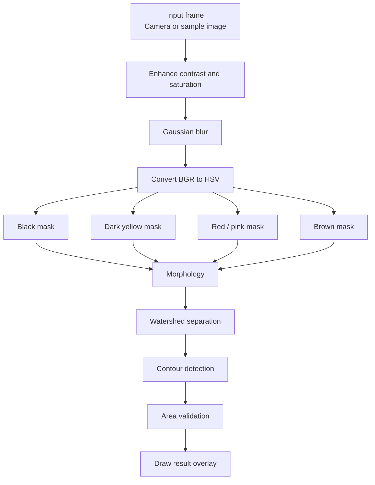
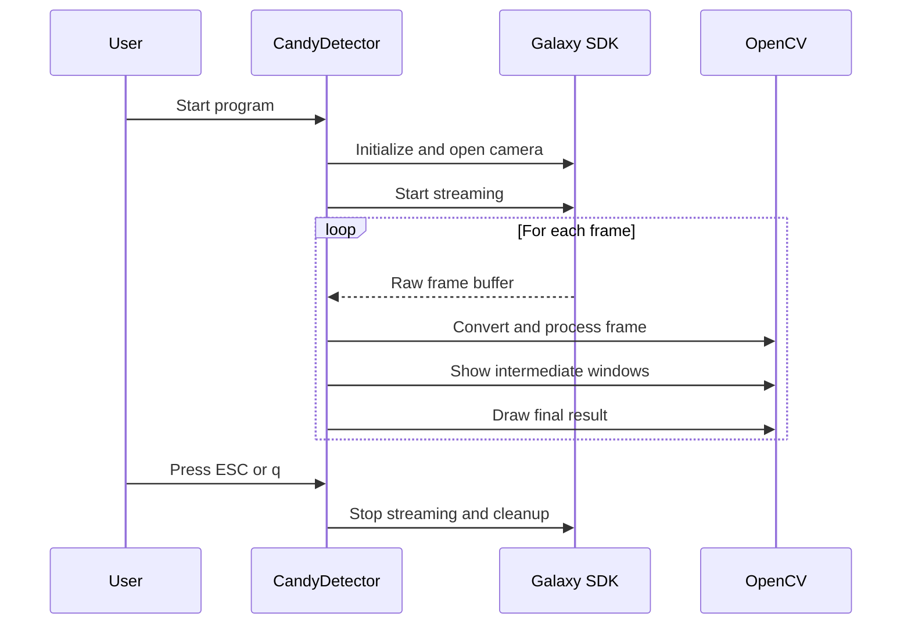

# Software Design

## Purpose
This program is a vision pipeline for detecting candies in camera frames using OpenCV and the Daheng/Galaxy SDK. It supports two runtime modes:

- Live camera mode for real hardware acquisition.
- Debug mode for browsing sample images in `./images/`.

The pipeline detects multiple candy color classes, applies morphology and watershed separation, and draws detections with labels and size validation.

## Project Layout

The `CandyDetector` folder contains the complete application for this vision stage:

- `CandyDetector.cpp` - main application, pipeline, UI, and camera/debug runtime.
- `Makefile` - build configuration for the project.
- `images/` - sample input images used by debug mode.
- `CandyDetector` - compiled executable.

## High-Level Architecture

The application is organized into four main parts:

1. Runtime control
   - Parses command-line flags.
   - Chooses between live camera mode and debug mode.
   - Creates windows and trackbars.

2. Image acquisition
   - Reads frames from the Daheng/Galaxy camera.
   - Converts raw camera output into BGR OpenCV images.
   - Loads sample images in debug mode.

3. Image processing pipeline
   - Enhances contrast and saturation.
   - Applies blur.
   - Converts to HSV.
   - Builds color masks.
   - Runs morphology.
   - Separates touching objects with watershed.
   - Finds contours and validates object size.

4. Output and visualization
   - Shows intermediate pipeline steps in separate windows.
   - Draws bounding boxes and labels on the final result image.

## Runtime Modes

### Live Camera Mode
The default mode connects to the first available Daheng camera, starts acquisition, and processes each frame in a loop until the user presses `ESC` or `q`.

### Debug Mode
When started with `--debug` or `-d`, the program loads images from `./images/` and lets the user step through them with:

- `Space` or right arrow for next image.
- Left arrow for previous image.
- `ESC` or `q` to quit.

When `--adjust` or `-a` is added, the full set of pipeline windows and trackbars is enabled.

## Processing Pipeline



## Data Flow

```mermaid
flowchart LR
    Camera[Daheng camera] --> Raw[Raw frame buffer]
    Raw --> Convert[OpenCV BGR image]
    Convert --> Process[processFrame()]
    Process --> Windows[Intermediate windows]
    Process --> Result[Final annotated result]
    Trackbars[Trackbars / parameters] --> Process
```

## UI Layout

The UI is split into a final result view and optional step-by-step diagnostic views.

### Result Only Mode
Only the final detection window is shown:

- `8 - Result`

### Adjust Mode
The following windows are created to inspect each stage of the pipeline:

- `0 - Enhanced`
- `1 - Blurred`
- `3a - Mask: Black`
- `3b - Mask: DarkYellow`
- `3c - Mask: Red/Pink`
- `3d - Mask: Brown`
- `4a - Morphology: Black`
- `4d - Watershed DT (Yellow)`
- `4e - Watershed DT (Red)`
- `4f - Separated: Black`
- `4g - Separated: DarkYellow`
- `4h - Separated: Red/Pink`
- `4i - Separated: Brown`
- `6 - Contours`
- `8 - Result`

Trackbars are attached to the relevant processing windows to tune thresholds, kernel sizes, and area limits without rebuilding the application.

## Core Modules Inside `CandyDetector.cpp`

### `main()`
Owns startup, flag parsing, SDK initialization, camera setup, streaming, frame acquisition, and cleanup.

### `runDebugMode()`
Loads local images, cycles through them with keyboard input, and reprocesses the active image when parameters change.

### `createWindows()`
Creates OpenCV windows and attaches trackbars for interactive tuning.

### `applyWatershed()`
Separates touching objects by combining distance transform, connected components, and watershed boundary extraction.

### `processFrame()`
Implements the complete vision pipeline for one frame and renders all intermediate and final outputs.

## Detection Logic

The pipeline classifies candies by color into four groups:

- Black / sugar-coated candies
- Dark yellow candies
- Red / pink candies
- Brown candies

Each class uses its own HSV thresholds. After segmentation, morphology cleans the masks, watershed tries to split connected objects, and contour area thresholds decide whether a region is accepted.

Detections are drawn with a bounding box and status label:

- Green box for valid size
- Red box for invalid size or forced invalid classes

## Sequence Overview



## Design Notes

- Parameter tuning is intentionally interactive so the pipeline can be calibrated on real objects and lighting.
- The code separates colour masks because the different candy classes need different HSV ranges.
- Watershed is used only where object overlap is likely to matter.
- Debug mode is useful for developing the pipeline without camera hardware.

## Summary

The software is a single C++ vision application with a clear runtime split between acquisition, processing, and visualization. Its design favors iterative tuning and inspection of intermediate results, which makes it practical for vision calibration in a machine-building context.
